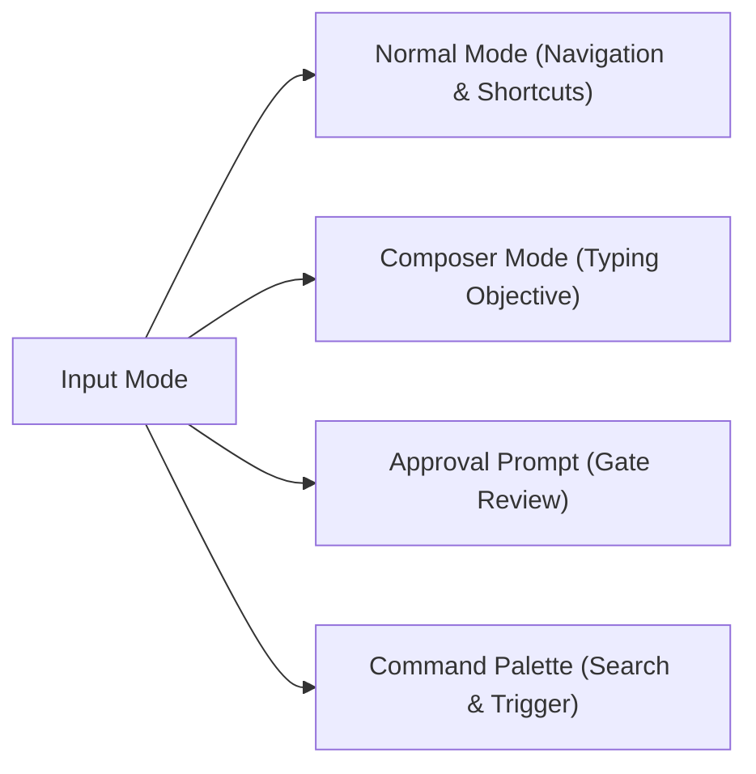

# Codypendent CLI & TUI User Guide

> **Product:** Codypendent — The local-first agentic developer environment
> **Version:** 0.2.0
> **Documentation Target:** CLI reference, Ratatui TUI shortcuts, environment setup, and workflow operations.

---

## 1. Overview & Quickstart

**Codypendent** operates on a client-daemon architecture. Intelligence, state management, git worktree isolation, and session history live within the background daemon process (`codypendentd`), while the user interacts via the **CLI**, the interactive **Ratatui TUI**, or integrated IDE extensions (VS Code, Cursor, Zed).

### Executive Naming Summary
- `codypendent`: Unified CLI and interactive TUI entry point.
- `codypendent daemon`: Management command for the daemon server.
- `codypendentd`: The backend daemon executable.
- `.codypendent/`: Local repository and user configuration directory.

### Quickstart Commands
```bash
# Start an interactive TUI session in the current repository
codypendent

# Run a headless agent run with JSONL event streaming
codypendent run --objective "Fix failing unit tests in crates/runtime" --mode build --jsonl

# Validate a multi-agent declarative workflow manifest
codypendent workflow validate path/to/workflow.yaml
```

---

## 2. Daemon Management (`codypendent daemon`)

The daemon manages sessions, model routing, database storage, git worktree allocations, and policy enforcement. Commands automatically start the daemon if it is not already running.

```text
codypendent daemon start         # Start the background daemon
codypendent daemon status        # Check daemon status (exit 0 if running, exit 1 if stopped)
codypendent daemon status --json # Output machine-readable JSON status
codypendent daemon stop          # Gracefully shut down the daemon
```

---

## 3. Interactive TUI Reference (`codypendent`)

Running `codypendent` with no subcommands opens the interactive Ratatui terminal user interface attached to the current directory's repository session.

### 3.1 Theme Selection & Accessibility

The TUI automatically detects terminal capabilities (`COLORTERM`, `NO_COLOR`, `TERM`), but can be explicitly overridden:

```bash
# Via command line flag
codypendent --theme light
codypendent --theme high-contrast

# Via environment variable
export CODYPENDENT_THEME=color-blind-safe
codypendent
```

#### Supported Built-in Themes:
- `dark` (default dark mode)
- `light` (bright background preset)
- `high-contrast` (accessibility high-contrast palette)
- `color-blind-safe` (Deuteranopia/Protanopia friendly colors)
- `ansi256` / `ansi16` (legacy terminal fallbacks)
- `monochrome` (grayscale / no-color mode)

---

### 3.2 Keyboard & Mouse Parity Reference

The TUI guarantees 100% feature parity between keyboard hotkeys and mouse actions.



#### Complete Hotkey Matrix

| Category | Key | Action | Mouse Equivalent |
| :--- | :--- | :--- | :--- |
| **Navigation** | `F2` | Toggle layout (Chat ⇄ Workspace Panes) | Click Layout Button |
| | `Tab` | Cycle focused pane | Click Pane Header |
| | `↑` / `↓` or `k` / `j` | Move selection in list / browser / palette | Scroll Wheel |
| | `PgUp` / `PgDn` | Scroll chat conversation history | Scroll Wheel on Chat |
| | `Ctrl-↑` / `Ctrl-↓` | Switch to previous / next active run | - |
| **Run Control** | `n` | Start a new run | Click "+ New Run" |
| | `p` | Pause current run | Click "Pause" |
| | `c` | Cancel active run | Click "Cancel" |
| | `s` | Steer / add prompt to running agent | - |
| | `q` or `Ctrl-C` | Detach TUI (run continues in daemon) | Click "Detach" |
| **Approvals** | `a` | Approve requested action **once** | Click "Approve Once" |
| | `A` | Approve requested action **for the whole run** | Click "Approve All" |
| | `r` | Reject proposed action | Click "Reject" |
| **Studios & Views** | `/` | Open searchable Command Palette | Click Palette Icon |
| | `S` | Open Skills Studio | Click Skills Tab |
| | `M` | Open Memory & Knowledge Fabric Browser | Click Memory Tab |
| | `o` | Open current source file in external editor | Click File Link |
| | `D` | Open Collaborative Docs Studio | Click Docs Tab |
| | `G` | Open Code Graph Edge Inspector | Click Graph Node |
| | `W` | Open Workflow Conductor View | Click Workflow Tab |
| | `B` | Open Agent Blackboard / Claims View | Click Blackboard Tab |
| | `?` | Toggle Help Overlay | Click Help Button |
| | `Esc` | Clear draft, exit prompt, or close overlay | - |

---

## 4. Command-Line Interface (CLI) Reference

### 4.1 Headless Execution & Event Attaching

Run agents headlessly or stream events directly into JSON pipelines:

```bash
# Start a headless run
codypendent run \
  --objective "Add unit tests for workspace.read_file" \
  --mode build \
  --repo /path/to/repo \
  --jsonl

# Attach to an existing session from a specific event sequence cursor
codypendent attach <SESSION_ID> --from-sequence 42 --events jsonl
```

### 4.2 Declarative Workflows (`codypendent workflow` & `codypendent fix-ci`)

Manage multi-agent declarative workflows and automated repairs:

```bash
# Repair a failing GitHub Actions check on a pull request (/fix-ci)
codypendent fix-ci --pr 482

# Validate workflow YAML structure and cross-check agent profiles
codypendent workflow validate workflows/ci-fix.yaml --agents .codypendent/agents

# Inspect compiled workflow graph as JSON or tree
codypendent workflow show workflows/ci-fix.yaml --json

# Start a durable workflow run
codypendent workflow run workflows/ci-fix.yaml --inputs '{"pull_request": 482}'

# Pause, resume, or retry workflow runs
codypendent workflow pause <WORKFLOW_RUN_ID>
codypendent workflow resume <WORKFLOW_RUN_ID>
codypendent workflow retry <WORKFLOW_RUN_ID> --node "fix_step"

# Cancel or watch live node transitions of a workflow run
codypendent workflow cancel <WORKFLOW_RUN_ID>
codypendent workflow watch <WORKFLOW_RUN_ID>
```

### 4.3 Plugin Security & Governance (`codypendent plugin`)

Inspect plugin manifests, audit permission expansions, verify ed25519 signatures, and manage trusted publishers:

```bash
# Inspect plugin capabilities, resource caps, and trust posture
codypendent plugin inspect path/to/plugin.toml

# Compare installed plugin against an update to detect permission expansions
codypendent plugin diff installed.toml update.toml

# Verify plugin artifact against manifest using trusted publisher key store
codypendent plugin verify manifest.toml artifact.tar.gz [--allow-unsigned]

# Install inert, exercise the production sandbox, then enable explicitly
codypendent plugin install plugin.toml package.cody-ui.tgz
codypendent plugin smoke-test <PLUGIN_ID>
codypendent plugin enable <PLUGIN_ID> --scope user
codypendent plugin enable <PLUGIN_ID> --scope session --session <SESSION_ID>
codypendent plugin list

# Stage an update; expanded permissions return an exact one-shot receipt
codypendent plugin update <PLUGIN_ID> plugin.toml package.cody-ui.tgz
codypendent plugin approve-update <PLUGIN_ID> <APPROVAL_RECEIPT>
codypendent plugin reject-update <PLUGIN_ID> <APPROVAL_RECEIPT>

# Immediately revoke authority and terminate active workers
codypendent plugin revoke <PLUGIN_ID>

# Manage trusted publisher ed25519 public keys
codypendent plugin trust add <PUBLISHER_ID> <BASE64_PUBLIC_KEY>
codypendent plugin trust list
codypendent plugin trust remove <PUBLISHER_ID>
```

`install` never enables code. `smoke-test` performs the framed worker handshake
inside the real sandbox. An update receipt is sealed to the candidate artifact,
publisher key, permission diff, and previous lifecycle state; it cannot approve
a different package. Secret entry and approval decisions remain host-owned even
when a plugin supplies explanatory UI.

### 4.4 Documentation Publishing (`codypendent docs`)

Publish collaborative CRDT documents to Git targets through approval-gated write paths:

```bash
# Publish a document to a repo file, dedicated docs branch, or documentation PR
codypendent docs publish <DOCUMENT_ID> --target repo-file --path docs/guide.md -y
codypendent docs publish <DOCUMENT_ID> --target doc-pr --title "Docs update"
```

### 4.5 Model Benchmarking, Evaluation & Promotion (`codypendent eval`, `models`, `promote`)

Benchmark local models, run evaluation suites, and drive learnable artifacts through human-gated promotion:

```bash
# Benchmark a local model in models.toml and record measured performance
codypendent models bench qwen2.5-coder-32b

# Execute an evaluation suite against a routing policy and produce a JSON report
codypendent eval run --suite core --policy coding-balanced --report report.json

# Draft and advance candidates through promotion pipeline (no self-promotion allowed)
codypendent promote propose --kind router --name tool-selection --version 2
codypendent promote advance <CANDIDATE_ID> --step regression
codypendent promote approve <CANDIDATE_ID> # Requires human operator approval
codypendent promote rollback <CANDIDATE_ID> # Roll back to predecessor version
```

### 4.6 IDE Integration & Handoff (`codypendent open` / `acp`)

```bash
# Open an ongoing TUI session inside VS Code, Cursor, or Zed
codypendent open <SESSION_ID> --in vscode
codypendent open <SESSION_ID> --in cursor
codypendent open <SESSION_ID> --in zed

# Serve Zed ACP (Agent Communication Protocol) over stdio (used by editor settings)
codypendent acp --repo /path/to/repo
```

### 4.7 Knowledge Index Maintenance (`codypendent index`)

```bash
# Rebuild Tantivy search and tree-sitter code graph indexes from SQLite
codypendent index rebuild
```

---

## 5. Agent Modes & Policy Enforcements

Codypendent uses 5 distinct agent modes to enforce execution boundaries:

| Mode | Writes Permitted? | Worktree Isolation | Purpose |
| :--- | :---: | :---: | :--- |
| **Ask** | ❌ No | Shared Checkout | Answer questions & explain code without changing files. |
| **Explore** | ❌ No | Shared Checkout | Search symbols, analyze architecture, & inspect graphs. |
| **Plan** | ❌ No | Shared Checkout | Draft implementation plans and step-by-step proposals. |
| **Build** | ✅ Yes | Isolated Worktree | Active code creation, shell execution, & test running. |
| **Review** | ❌ No | Shared Checkout | Perform security audits, diff reviews, & code checks. |

> [!NOTE]
> During **Build** mode, each run is carved its own isolated git worktree. Writes and reads hit the isolated tree (`read-your-writes`), ensuring zero pollution of your working branch until changes are approved and merged.
