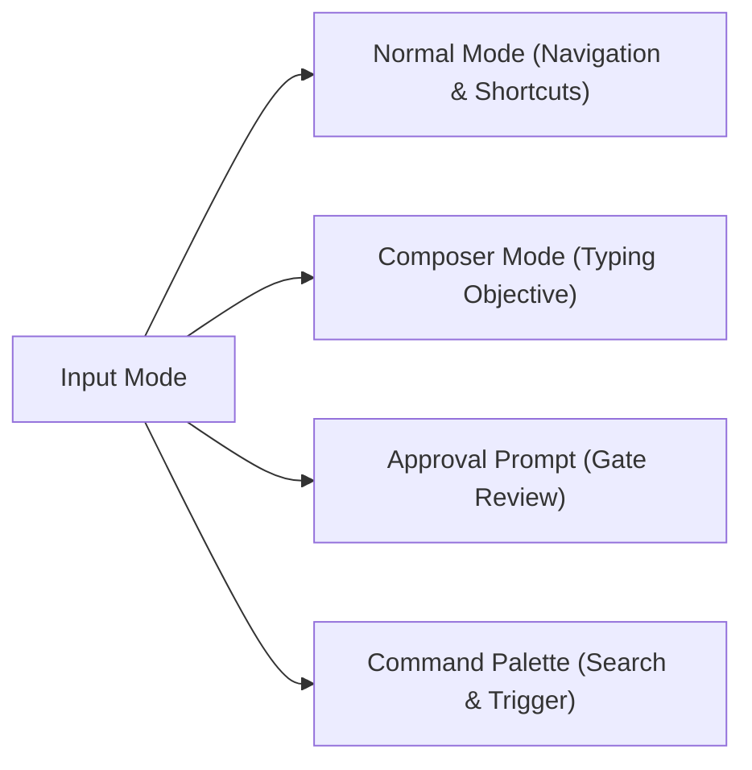

# Codypendent CLI & TUI User Guide

> **Product:** Codypendent — The local-first agentic developer environment
> **Version:** 0.3.2
> **Documentation Target:** CLI reference, Ratatui TUI shortcuts, environment setup, and workflow operations.

---

## 1. Overview & Quickstart

**Codypendent** operates on a client-daemon architecture. Intelligence, state management, git worktree isolation, and session history live within the background daemon process (`codypendentd`), while the user interacts via the **CLI**, the interactive **Ratatui TUI**, or integrated IDE extensions (VS Code, Cursor, Zed).

### Executive Naming Summary
- `codypendent`: Unified CLI and interactive TUI entry point.
- `codypendent daemon`: Management command for the daemon server.
- `codypendentd`: The backend daemon executable.
- `.codypendent/`: Local repository and user configuration directory.

### Quickstart Commands
```bash
# Start an interactive TUI session in the current repository
codypendent
# When startup is ready, press Enter to open the workspace (Esc quits).

# Use the cooked, line-oriented accessibility client
codypendent --accessible # --plain is an equivalent alias

# Run a headless agent run with JSONL event streaming
codypendent run --objective "Fix failing unit tests in crates/runtime" --mode build --jsonl

# Validate a multi-agent declarative workflow manifest
codypendent workflow validate path/to/workflow.yaml
```

---

## 2. Daemon Management (`codypendent daemon`)

The daemon manages sessions, model routing, database storage, git worktree allocations, and policy enforcement. Commands automatically start the daemon if it is not already running.

```text
codypendent daemon start         # Start the background daemon
codypendent daemon status        # Check daemon status (exit 0 if running, exit 1 if stopped)
codypendent daemon status --json # Output machine-readable JSON status
codypendent daemon stop          # Gracefully shut down the daemon
```

---

## 3. Interactive TUI Reference (`codypendent`)

Running `codypendent` with no subcommands opens the interactive Ratatui terminal user interface attached to the current directory's repository session. Startup finishes on a welcome screen so you can read any diagnostics and confirm the workspace; press `Enter` to proceed or `Esc` to quit.

### 3.1 Theme Selection & Accessibility

The TUI automatically detects terminal capabilities (`COLORTERM`, `NO_COLOR`, `TERM`), but can be explicitly overridden:

```bash
# Via command line flag
codypendent --theme light
codypendent --theme high-contrast

# Via environment variable
export CODYPENDENT_THEME=color-blind-safe
codypendent
```

#### Supported Built-in Themes:
- `dark` (default dark mode)
- `light` (bright background preset)
- `high-contrast` (accessibility high-contrast palette)
- `color-blind-safe` (Deuteranopia/Protanopia friendly colors)
- `ansi256` / `ansi16` (legacy terminal fallbacks)
- `monochrome` (grayscale / no-color mode)

---

### 3.2 Keyboard & Mouse Parity Reference

The TUI guarantees 100% feature parity between keyboard hotkeys and mouse actions.



#### Complete Hotkey Matrix

| Category | Key | Action | Mouse Equivalent |
| :--- | :--- | :--- | :--- |
| **Navigation** | `F2` | Toggle layout (Chat ⇄ Workspace Panes) | Click Layout Button |
| | `Tab` | Cycle focused pane | Click Pane Header |
| | `↑` / `↓` or `k` / `j` | Move selection in list / browser / palette | Scroll Wheel |
| | `PgUp` / `PgDn` | Scroll chat conversation history | Scroll Wheel on Chat |
| | `Ctrl-↑` / `Ctrl-↓` | Switch to previous / next active run | - |
| **Remote UI** | `F6` | Enter the mounted extension document without activating a control | Click extension chrome / the "Extension UI ready" footer |
| | `Shift-F6` | Focus the next mounted extension document | - |
| | `Tab` / `Shift-Tab` | Move through controls across all mounted documents | Click a control |
| | `Enter` / `Space` | Activate the focused extension control | Click the control |
| | `Esc` | Return to the conversation composer | - |
| **Run Control** | `n` | Start a new run | Click "+ New Run" |
| | `p` | Pause current run | Click "Pause" |
| | `c` | Cancel active run | Click "Cancel" |
| | `s` | Steer / add prompt to running agent | - |
| | `q` or `Ctrl-C` | Detach TUI (run continues in daemon) | Click "Detach" |
| **Approvals** | `a` | Approve requested action **once** | Click "Approve Once" |
| | `A` | Approve requested action **for the whole run** | Click "Approve All" |
| | `r` | Reject proposed action | Click "Reject" |
| **Studios & Views** | `/` | Open searchable Command Palette | Click Palette Icon |
| | `S` | Open Skills Studio | Click Skills Tab |
| | `M` | Open Memory & Knowledge Fabric Browser | Click Memory Tab |
| | `o` | Open current source file in external editor | Click File Link |
| | `D` | Open Collaborative Docs Studio | Click Docs Tab |
| | `G` | Open Code Graph Edge Inspector | Click Graph Node |
| | `W` | Open Workflow Conductor View | Click Workflow Tab |
| | `B` | Open Agent Blackboard / Claims View | Click Blackboard Tab |
| | `?` | Toggle Help Overlay | Click Help Button |
| | `Esc` | Clear draft, exit prompt, or close overlay | - |

---

### 3.3 Cooked accessibility mode (`--accessible` / `--plain`)

Use `codypendent --accessible` (or `codypendent --plain`) with a screen reader,
a limited terminal, or redirected stdin/stdout. It stays in ordinary cooked
terminal mode: no alternate screen, raw input, mouse capture, colour escapes,
Unicode chrome, or cursor-addressed redraws. Each change prints a complete,
stable, linear snapshot, including extension-provided accessibility text,
semantic controls, keyboard hints, disabled state, and live-region metadata.

Input is one command per line:

| Command | Effect |
| :--- | :--- |
| Any ordinary line | Send it from the conversation composer |
| `type TEXT` / `send TEXT` | Insert text / insert and submit in the current input surface |
| `help` or `?` | Show the complete command and key reference |
| `f6` / `shift-f6` / `esc` | Enter Remote UI / next document / return |
| `tab` / `backtab` | Move semantic focus forward / backward |
| `enter` / `space` | Activate the focused control |
| `up`, `down`, `pageup`, `pagedown` | Navigate the current list or document |
| `approve`, `approve-run`, `reject` | Resolve the selected approval |
| `quit` | Detach; the daemon keeps active runs alive |

`COLUMNS` and `LINES` set the viewport advertised to extension components;
defaults are `80` by `24`.

---

## 4. Command-Line Interface (CLI) Reference

### 4.1 Headless Execution & Event Attaching

Run agents headlessly or stream events directly into JSON pipelines:

```bash
# Start a headless run
codypendent run \
  --objective "Add unit tests for workspace.read_file" \
  --mode build \
  --repo /path/to/repo \
  --jsonl

# Attach to an existing session from a specific event sequence cursor
codypendent attach <SESSION_ID> --from-sequence 42 --events jsonl
```

### 4.2 Declarative Workflows (`codypendent workflow` & `codypendent fix-ci`)

Manage multi-agent declarative workflows and automated repairs:

```bash
# Repair a failing GitHub Actions check on a pull request (/fix-ci)
codypendent fix-ci --pr 482

# Validate workflow YAML structure and cross-check agent profiles
codypendent workflow validate workflows/ci-fix.yaml --agents .codypendent/agents

# Inspect compiled workflow graph as JSON or tree
codypendent workflow show workflows/ci-fix.yaml --json

# Start a durable workflow run
codypendent workflow run workflows/ci-fix.yaml --inputs '{"pull_request": 482}'

# Pause, resume, or retry workflow runs
codypendent workflow pause <WORKFLOW_RUN_ID>
codypendent workflow resume <WORKFLOW_RUN_ID>
codypendent workflow retry <WORKFLOW_RUN_ID> --node "fix_step"

# Cancel or watch live node transitions of a workflow run
codypendent workflow cancel <WORKFLOW_RUN_ID>
codypendent workflow watch <WORKFLOW_RUN_ID>
```

### 4.3 Plugin Security & Governance (`codypendent plugin`)

Inspect plugin manifests, audit permission expansions, verify ed25519 signatures, and manage trusted publishers:

```bash
# Inspect plugin capabilities, resource caps, and trust posture
codypendent plugin inspect path/to/plugin.toml

# Compare installed plugin against an update to detect permission expansions
codypendent plugin diff installed.toml update.toml

# Verify plugin artifact against manifest using trusted publisher key store
codypendent plugin verify manifest.toml artifact.tar.gz [--allow-unsigned]

# Install inert, exercise the production sandbox, then enable explicitly
codypendent plugin install plugin.toml package.cody-ui.tgz
codypendent plugin smoke-test <PLUGIN_ID>
codypendent plugin enable <PLUGIN_ID> --scope user
codypendent plugin enable <PLUGIN_ID> --scope session --session <SESSION_ID>
codypendent plugin list

# Stage an update; expanded permissions return an exact one-shot receipt
codypendent plugin update <PLUGIN_ID> plugin.toml package.cody-ui.tgz
codypendent plugin approve-update <PLUGIN_ID> <APPROVAL_RECEIPT>
codypendent plugin reject-update <PLUGIN_ID> <APPROVAL_RECEIPT>

# Immediately revoke authority and terminate active workers
codypendent plugin revoke <PLUGIN_ID>

# Manage trusted publisher ed25519 public keys
codypendent plugin trust add <PUBLISHER_ID> <BASE64_PUBLIC_KEY>
codypendent plugin trust list
codypendent plugin trust remove <PUBLISHER_ID>
```

`install` never enables code. `smoke-test` performs the framed worker handshake
inside the real sandbox. An update receipt is sealed to the candidate artifact,
publisher key, permission diff, and previous lifecycle state; it cannot approve
a different package. Secret entry and approval decisions remain host-owned even
when a plugin supplies explanatory UI.

### 4.4 Documentation Publishing (`codypendent docs`)

Publish collaborative CRDT documents to Git targets through approval-gated write paths:

```bash
# Publish a document to a repo file, dedicated docs branch, or documentation PR
codypendent docs publish <DOCUMENT_ID> --target repo-file --path docs/guide.md -y
codypendent docs publish <DOCUMENT_ID> --target doc-pr --title "Docs update"
```

### 4.5 Model Benchmarking, Evaluation & Promotion (`codypendent eval`, `models`, `promote`)

Benchmark local models, run evaluation suites, and drive learnable artifacts through human-gated promotion:

```bash
# Benchmark a local model in models.toml and record measured performance
codypendent models bench qwen2.5-coder-32b

# Execute an evaluation suite against a routing policy and produce a JSON report
codypendent eval run --suite core --policy coding-balanced --report report.json

# Draft and advance candidates through promotion pipeline (no self-promotion allowed)
codypendent promote propose --kind router --name tool-selection --version 2
codypendent promote advance <CANDIDATE_ID> --step regression
codypendent promote approve <CANDIDATE_ID> # Requires human operator approval
codypendent promote rollback <CANDIDATE_ID> # Roll back to predecessor version
```

### 4.5.1 Local models via Unsloth

Codypendent can browse the [Unsloth](https://huggingface.co/unsloth) org's
GGUF catalog on Hugging Face, pull a quant through
[Ollama](https://ollama.com), and register it as a selectable local model —
and, separately, scaffold a QLoRA fine-tuning project for the same family of
base models. **Honesty first:** Codypendent itself needs neither a GPU nor
Ollama to run; both of the flows below shell out to binaries you install
yourself (`ollama` for pulling, a CUDA-capable Python environment for
fine-tuning), and every command degrades to an actionable error — never a
silent failure or a fabricated result — when they're missing.

```bash
# Resolve unsloth/Qwen3-32B-GGUF, auto-pick a quant (Q4_K_M if present, or
# the repo's only quant; otherwise it lists the choices instead of guessing),
# drive `ollama pull` with streamed progress, and register the result
codypendent models pull Qwen3-32B-GGUF

# Pin an exact quant, or pull from outside the unsloth org
codypendent models pull Qwen3-32B-GGUF:UD-Q4_K_XL
codypendent models pull some-org/Some-Model-GGUF:Q8_0
```

`models pull` registers the pulled model in `models.toml` against the
`ollama` provider using the **exact reference Ollama itself uses**
(`hf.co/<org>/<repo>:<quant>` — what `ollama list` shows, and what the
OpenAI-compatible `model` field must match at call time), carrying
`context_tokens` from the repo's Hugging Face metadata when the Hub reports
one. It prints a `codypendent models bench <id>` suggestion afterward so the
router gets a measured profile, exactly like any other freshly-added local
model. Requires `ollama` on `PATH`; a missing binary fails with an
`install it from https://ollama.com` message rather than a bare error.

The TUI offers the same catalog browse through the command palette. Press
`/`, select **Local models: browse Unsloth catalog**, and step through:

1. **Repos** — a fuzzy-filterable list of the org's GGUF repos (downloads,
   likes, last updated), fetched live from the Hub.
2. **Quants** — for the chosen repo, every quant variant parsed from its file
   tree (including Unsloth's dynamic `UD-` quants and multi-part split
   files), each with its combined download size.
3. **Confirm** — a yes/no prompt naming the exact `ollama pull` reference and
   its download size before anything downloads.
4. **Progress** — live `ollama pull` output, then a registered-model notice
   (or the failure, verbatim) once it finishes. Closing this view with `Esc`
   does not cancel the pull — it keeps running detached, the same way a
   dismissed model-discovery query does.

```bash
# Scaffold a standalone Unsloth QLoRA fine-tuning project (pinned
# requirements, a train.py for the base model, a JSONL dataset stub, and a
# README covering GPU requirements, training, GGUF export, and `ollama
# create`). Refuses if the target directory already exists.
codypendent finetune init
codypendent finetune init --model unsloth/Qwen3-8B-unsloth-bnb-4bit --out my-finetune

# Verify Python and CUDA are present on THIS machine before training there.
# A missing GPU only warns (the scaffold is still useful without one); a
# missing Python interpreter fails.
codypendent finetune check

# Seed dataset/train.jsonl from the repo's own session/eval history, where a
# clean seam exists to do so. Today it prints exactly why that seam doesn't
# exist yet (a daemon-side transcript-reconstruction API the CLI can't reach
# read-only) instead of silently producing nothing.
codypendent finetune dataset export
```

The scaffolded project is entirely separate from Codypendent's own build:
`train.py` is a normal Unsloth QLoRA script you run yourself, on a machine
with an NVIDIA GPU. Once you've exported a GGUF and run `ollama create` on
it (both covered in the scaffold's own `README.md`), add the result to
Codypendent the same way as any other local Ollama model — via the
`/model`/`/provider` picker, or a hand-written `[[model]]` entry in
`models.toml` — then `codypendent models bench <id>` to measure it.

### 4.6 IDE Integration, ACP Agents & Handoff (`codypendent open` / `acp`)

```bash
# Open an ongoing TUI session inside VS Code, Cursor, or Zed
codypendent open <SESSION_ID> --in vscode
codypendent open <SESSION_ID> --in cursor
codypendent open <SESSION_ID> --in zed

# Discover all agents in the curated official ACP registry
codypendent acp list --refresh

# Install, handshake, and add Claude Code or Codex to the model picker
codypendent acp connect claude-acp
codypendent acp connect codex-acp
# Friendly product names are accepted too:
codypendent acp connect claude-code
codypendent acp connect codex

# Other registry agents work through the same flow (Gemini, OpenCode, Goose,
# GitHub Copilot CLI, Cursor, Cline, Qwen Code, and the complete registry)
codypendent acp connect gemini
codypendent acp connect kimi-code
codypendent acp connect amp
codypendent acp connect vibe-chat       # official id: mistral-vibe
codypendent acp status

# Send a real session/prompt compatibility check; every tool request is denied
codypendent acp probe codex

# Remove a selectable profile without deleting the shared download cache
codypendent acp disconnect acp/codex-acp

# Serve Codypendent itself as an ACP (Agent Client Protocol) agent for Zed
codypendent acp --repo /path/to/repo
# Equivalent explicit spelling:
codypendent acp serve --repo /path/to/repo
```

The registry is discovered from ACP's curated v1 endpoint on first use, cached
under the Codypendent data directory, and refreshed automatically after 24
hours (with a validated stale-cache fallback when offline). NPM and Python
distributions are launched at the exact version in the registry. Platform
archives are installed only on an
explicit `install`/`connect`, are SHA-256 verified when the registry supplies a
digest, and are extracted with traversal, link, duplicate-path, entry-count,
and size limits. An entry without a digest requires the explicit
`--allow-unverified` acknowledgement.

Known native ACP servers are also detected without replacing the curated
catalog. In particular, `~/.kimi-code/bin/kimi` (or a `kimi` on `PATH`) appears
as `kimi-code`, launches `kimi acp`, shares the credentials created by
`kimi login`, and pins the executable's bounded `--version` result. The older
official `kimi` registry entry remains separately addressable as `kimi-cli`.

Discovery tracks the latest catalogue, but connecting snapshots an immutable
`agent-id@version` coordinate into the model profile. A daily registry refresh
can reveal a newer client without silently upgrading an agent used by an
existing run; reconnect explicitly when you want to adopt the new version.

Each agent keeps its own normal authentication flow. Sign in to Claude Code,
Codex, Kimi, Amp, Mistral Vibe, or the relevant vendor CLI as required; the ACP
handshake verifies protocol compatibility but does not copy or persist vendor
credentials in Codypendent.

ACP profiles appear in `/model` alongside native model endpoints. During a run,
the external agent owns its model and tool loop; Codypendent still owns the
worktree allocation, durable transcript, approval UI, cancellation, diff
review, chronicle, and terminal state. Build-mode runs receive an isolated
worktree; read-only modes use the selected repository without granting
Codypendent write authority. The process remains a trusted local vendor
executable with the normal OS authority of your user account. ACP permission
requests are therefore resolved through the same host-owned approval queue as
native tools, but that cooperative protocol boundary is not an OS sandbox.

### 4.6.1 Multi-provider agent councils

Councils let native models and connected ACP agents deliberate together. A
definition contains 2-8 distinct configured model profiles, a role for each,
one configured chair profile, and 1-3 rounds. Round one produces independent
reports in parallel. Later rounds receive the bounded, attributed prior dossier
and are explicitly asked to challenge it. The chair then reconciles evidence,
uncertainty, and dissent into the final answer.

```bash
# MODEL=ROLE; repeat --member for every participant.
codypendent council create release-board \
  --member acp/claude-acp=maintainer \
  --member acp/codex-acp=security-critic \
  --member acp/kimi-code=researcher \
  --chair acp/amp-acp \
  --rounds 2 \
  --description "Independent release review"

codypendent council list
codypendent council show release-board
codypendent council run release-board \
  --objective "Should this change ship, and what must be fixed first?"
codypendent council run release-board --objective "..." --json
codypendent council remove release-board
```

Council runs use `Ask` policy, tell members not to invoke tools or modify files,
and require at least two successful member reports in every round. Each member
and the chair receives its own durable session/run, with the selected profile
pinned explicitly. A failed participant is reported; a surviving quorum may
continue. Responses, dossiers, concurrency, rounds, and time are bounded.
`councils.toml` is written atomically with user-only permissions.

The normal TUI includes the same creation flow. Press `/`, select
`/council  Agent council`, and complete these pages:

1. Enter a stable council name and optional purpose.
2. Pick a configured model profile, enter its role, and repeat until 2-8 unique
   members are present. Provider names and readiness are shown beside models.
3. Select the synthesis chair and choose 1-3 deliberation rounds.
4. Review the complete definition and press Enter to create it.

`Esc` moves back one page without discarding the draft (and closes from the
first page). The final write is performed by the CLI host through the same
validation and private atomic store as `codypendent council create`; the TUI
renderer itself never performs filesystem I/O.

### 4.7 Knowledge Index Maintenance (`codypendent index`)

```bash
# Rebuild Tantivy search and tree-sitter code graph indexes from SQLite
codypendent index rebuild
```

---

## 5. Voice (Speech-to-Text & Text-to-Speech)

Voice is **optional and off by default**. Turning it on takes two things
Codypendent deliberately does not ship: a **recorder binary** already on your
machine, and an **API key for a speech provider**. Nothing below works without
them, and nothing below is enabled implicitly.

> [!WARNING]
> Voice was developed and tested on a machine with **no audio hardware**. The
> request shapes, configuration handling, classification gate, and every failure
> path are covered by tests (mock HTTP servers and fake recorder/player
> commands), but **no part of the capture or playback path has been exercised
> against a real microphone or speaker**. Treat your first recording on real
> hardware as unverified, and expect to tune `record_command` for your device.

### 5.1 Configuration

All of voice lives in three optional tables in `<data_dir>/models.toml`,
alongside your `[[model]]` entries:

```toml
# Speech-to-text: what your voice notes are transcribed with.
[transcription]
base_url = "https://api.groq.com/openai/v1"
model = "whisper-large-v3-turbo"
api_key_env = "GROQ_API_KEY"
# local = true    # set ONLY for an on-device engine (see 5.4)

# Text-to-speech: what reads replies aloud. Optional.
[speech]
base_url = "https://api.openai.com/v1"
model = "gpt-4o-mini-tts"
voice = "alloy"
format = "mp3"
api_key_env = "OPENAI_API_KEY"

# The client-side commands voice drives.
[voice]
# Omit to auto-detect rec/arecord/ffmpeg on $PATH.
record_command = ["rec", "-q", "-r", "16000", "-c", "1", "-b", "16", "{path}"]
# Required to hear replies; the clip is fed to this command on stdin.
play_command = ["mpv", "--no-terminal", "-"]
push_to_talk_key = "F4"
```

Keys resolve exactly as chat models' do: a key saved via `/keys` (in
`auth.json`) wins, then the named environment variable. Only the variable
**name** is ever written to disk.

Because `/audio/transcriptions` and `/audio/speech` are the ordinary
OpenAI-compatible endpoints, any provider serving them works — **Groq**
(`whisper-large-v3`, `whisper-large-v3-turbo`), **OpenAI**
(`gpt-4o-transcribe`, `gpt-4o-mini-transcribe`, `tts-1`, `gpt-4o-mini-tts`),
**DeepInfra**, and **Together** among them.

### 5.2 Push-to-talk

Press **F4** (or your `push_to_talk_key`) to start recording; press it again to
stop and send. While recording, the status line shows a prominent
`◉ Recording` indicator that outranks every other status message.

On stop, the captured WAV is uploaded to the daemon's content-addressed
artifact store and submitted as an audio input envelope. The daemon transcribes
it and **the transcript becomes the run's objective**; a note reading
`transcribed 4.0 s of audio (model whisper-large-v3-turbo)` is appended to the
transcript so you can always see that the turn came from speech and what
produced it. The original audio is kept and linked to its transcript — a
transcript is an addition, never a replacement.

Codypendent bundles **no recorder**. It probes `$PATH` once at startup, in
order, for:

| Binary | Package | Notes |
| :--- | :--- | :--- |
| `rec` | `sox` | Preferred: portable, no platform-specific device spec. |
| `arecord` | `alsa-utils` | Linux/ALSA. |
| `ffmpeg` | `ffmpeg` | Last: its capture device is platform-specific and often needs `record_command` tuning. |

If none is found, pressing the key tells you so and names what to install — it
never silently does nothing. `record_command` overrides the probe entirely;
`{path}` is replaced with a temporary `.wav` path your command must write.

### 5.3 Speaking replies

Open the command palette and choose **"Voice: speak replies"**. Each assistant
turn is read aloud **once it is finished** — never mid-stream, because half a
sentence read aloud is worse than silence.

Synthesis and playback happen off the UI thread with a queue depth of one: if a
new turn finishes while a clip is still being produced, the newer one
**replaces** the queued one rather than queueing behind it, so speech tracks the
conversation instead of drifting minutes behind it. Playback pipes the clip to
your `play_command` on stdin and does not wait for it to finish.

With no `[speech]` entry or no `play_command`, the toggle turns itself back off
and says which one is missing.

### 5.4 Privacy: when audio may leave your machine

Captured audio is classified **Confidential** by default, so it cannot leave
your device by accident. Whether a transcription may be sent to a hosted
provider is decided by the daemon against the **same off-device ceiling that
governs hosted chat models** — `policy.max_off_device` in
`<data_dir>/routing.toml`. Voice deliberately reuses that ceiling instead of
adding a second, divergent privacy knob, so tightening it protects voice too.

* `[transcription].local = true` marks an **on-device** engine (e.g. a local
  whisper.cpp server). On-device transcription is permitted under **any**
  ceiling.
* Anything else is treated as leaving the device. Set it only when it is true —
  the flag defaults to `false`, so the safe classification is the one you get by
  saying nothing.
* With no `routing.toml`, the built-in `balanced` ceiling (`Confidential`) does
  permit remote transcription. To keep voice on-device, either lower the ceiling
  (e.g. `max_off_device = { type = "Internal" }`) or use a local engine.

When the ceiling forbids it, the submission is refused with
`voice.off-device-forbidden` **before any audio is read or transmitted** — the
run does not start, and nothing is sent.

---

## 6. Agent Modes & Policy Enforcements

Codypendent uses 5 distinct agent modes to enforce execution boundaries:

| Mode | Writes Permitted? | Worktree Isolation | Purpose |
| :--- | :---: | :---: | :--- |
| **Ask** | ❌ No | Shared Checkout | Answer questions & explain code without changing files. |
| **Explore** | ❌ No | Shared Checkout | Search symbols, analyze architecture, & inspect graphs. |
| **Plan** | ❌ No | Shared Checkout | Draft implementation plans and step-by-step proposals. |
| **Build** | ✅ Yes | Isolated Worktree | Active code creation, shell execution, & test running. |
| **Review** | ❌ No | Shared Checkout | Perform security audits, diff reviews, & code checks. |

> [!NOTE]
> During **Build** mode, each run is carved its own isolated git worktree. Writes and reads hit the isolated tree (`read-your-writes`), ensuring zero pollution of your working branch until changes are approved and merged.
