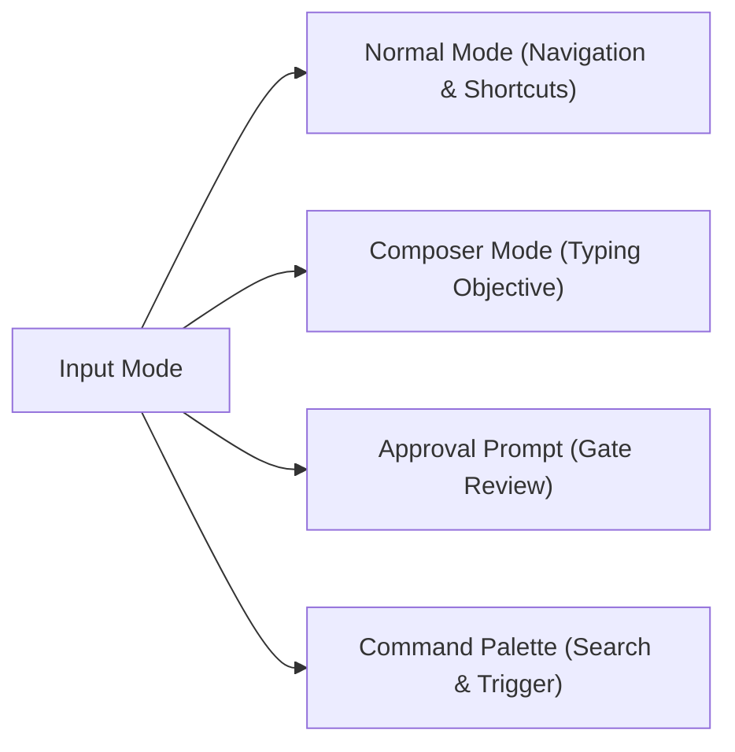

# Codypendent CLI & TUI User Guide

> **Product:** Codypendent — The local-first agentic developer environment
> **Version:** 0.3.2
> **Documentation Target:** CLI reference, Ratatui TUI shortcuts, environment setup, and workflow operations.

---

## 1. Overview & Quickstart

**Codypendent** operates on a client-daemon architecture. Intelligence, state management, git worktree isolation, and session history live within the background daemon process (`codypendentd`), while the user interacts via the **CLI**, the interactive **Ratatui TUI**, or integrated IDE extensions (VS Code, Cursor, Zed).

### Executive Naming Summary
- `codypendent`: Unified CLI and interactive TUI entry point.
- `codypendent daemon`: Management command for the daemon server.
- `codypendentd`: The backend daemon executable.
- `.codypendent/`: Local repository and user configuration directory.

### Quickstart Commands
```bash
# Start an interactive TUI session in the current repository
codypendent
# When startup is ready, press Enter to open the workspace (Esc quits).

# Use the cooked, line-oriented accessibility client
codypendent --accessible # --plain is an equivalent alias

# Run a headless agent run with JSONL event streaming
codypendent run --objective "Fix failing unit tests in crates/runtime" --mode build --jsonl

# Validate a multi-agent declarative workflow manifest
codypendent workflow validate path/to/workflow.yaml
```

---

## 2. Daemon Management (`codypendent daemon`)

The daemon manages sessions, model routing, database storage, git worktree allocations, and policy enforcement. Commands automatically start the daemon if it is not already running.

```text
codypendent daemon start         # Start the background daemon
codypendent daemon status        # Check daemon status (exit 0 if running, exit 1 if stopped)
codypendent daemon status --json # Output machine-readable JSON status
codypendent daemon stop          # Gracefully shut down the daemon
```

---

## 3. Interactive TUI Reference (`codypendent`)

Running `codypendent` with no subcommands opens the interactive Ratatui terminal user interface attached to the current directory's repository session. Startup finishes on a welcome screen so you can read any diagnostics and confirm the workspace; press `Enter` to proceed or `Esc` to quit.

### 3.1 Theme Selection & Accessibility

The TUI automatically detects terminal capabilities (`COLORTERM`, `NO_COLOR`, `TERM`), but can be explicitly overridden:

```bash
# Via command line flag
codypendent --theme light
codypendent --theme high-contrast

# Via environment variable
export CODYPENDENT_THEME=color-blind-safe
codypendent
```

#### Supported Built-in Themes:
- `dark` (default dark mode)
- `light` (bright background preset)
- `high-contrast` (accessibility high-contrast palette)
- `color-blind-safe` (Deuteranopia/Protanopia friendly colors)
- `ansi256` / `ansi16` (legacy terminal fallbacks)
- `monochrome` (grayscale / no-color mode)

---

### 3.2 Keyboard & Mouse Parity Reference

The TUI guarantees 100% feature parity between keyboard hotkeys and mouse actions.



#### Complete Hotkey Matrix

The TUI has no permanent buttons, tabs, or toolbars: every surface is either
the conversation, the composer, the one-line footer, or an overlay. The mouse
column below therefore names only the things that actually exist on screen —
rows, chips, and panes you can see. Where it says `-`, the mouse has no
equivalent and the key is the only way in.

| Category | Key | Action | Mouse Equivalent |
| :--- | :--- | :--- | :--- |
| **Navigation** | `F2` | Toggle layout (Chat ⇄ Workspace Panes) | Click the `F2 workspace` footer chip |
| | `Tab` | Cycle focused pane (Workspace layout) | Click a pane |
| | `↑` / `↓` or `k` / `j` | Move selection in list / browser / palette | Scroll wheel |
| | `PgUp` / `PgDn` | Scroll chat conversation history a page | Scroll wheel (3 lines per notch) |
| | `Ctrl-↑` / `Ctrl-↓` | Switch to previous / next active run | - |
| | `Alt-↑` / `Alt-↓` | Browse transcript folds (tool cards, diffs, long notes) | Click a fold line |
| | `Alt-Enter` | Expand / collapse the browsed fold, else insert a line break | Click a fold line |
| **Composer** | `←` / `→` / `Home` / `End` | Move the draft cursor (within its own line) | - |
| | `Ctrl-W` / `Ctrl-U` | Delete the word before the cursor / to the line start | - |
| | `↑` / `↓` | Move between the draft's lines; recall history at its edges | - |
| **Remote UI** | `F6` | Enter the mounted extension document without activating a control | Click extension chrome / the "Extension UI ready" footer |
| | `Shift-F6` | Focus the next mounted extension document | - |
| | `Tab` / `Shift-Tab` | Move through controls across all mounted documents | Click a control |
| | `Enter` / `Space` | Activate the focused extension control | Click the control |
| | `Esc` | Return to the conversation composer | - |
| **Run Control** | `n` | Start a new run | Palette row "New run" |
| | `p` | Pause current run | Palette row "Pause / resume run" |
| | `c` | Cancel active run | Palette row "Cancel run" |
| | `s` | Steer / add prompt to running agent | Palette row "Steer run" |
| | `q` or `Ctrl-C` | Detach TUI (run continues in daemon) | Palette row "Detach" |
| **Approvals** | `a` | Approve requested action **once** | Click the `a once` footer chip |
| | `A` | Approve requested action **for the whole run** | Click the `A run` footer chip |
| | `r` | Reject proposed action | Click the `r reject` footer chip |
| **Studios & Views** | `/` | Open searchable Command Palette | Click the `/ commands` footer chip |
| | `S` | Open Skills Studio | Palette row "Skills" (or the `S skills` chip in Memory) |
| | `M` | Open Memory & Knowledge Fabric Browser | Palette row "Memory" (or the `M memory` chip in Skills) |
| | `o` | Reveal the focused memory's source | Click the `o source` chip in Memory |
| | `D` | Open Collaborative Docs Studio | Palette row "Docs Studio" |
| | `G` | Open Code Graph Edge Inspector | Palette row "Code graph" |
| | `W` | Open Workflow Conductor View | Palette row "Workflows" |
| | `B` | Open Agent Blackboard / Claims View | Palette row "Blackboard" |
| | `?` | Toggle Help Overlay | Palette row "Help" |
| | `Esc` | Clear draft, exit prompt, or close overlay | Click outside an overlay, or its `Esc close` chip |

---

### 3.3 Cooked accessibility mode (`--accessible` / `--plain`)

Use `codypendent --accessible` (or `codypendent --plain`) with a screen reader,
a limited terminal, or redirected stdin/stdout. It stays in ordinary cooked
terminal mode: no alternate screen, raw input, mouse capture, colour escapes,
Unicode chrome, or cursor-addressed redraws. Each change prints a complete,
stable, linear snapshot, including extension-provided accessibility text,
semantic controls, keyboard hints, disabled state, and live-region metadata.

Input is one command per line:

| Command | Effect |
| :--- | :--- |
| Any ordinary line | Send it from the conversation composer |
| `type TEXT` / `send TEXT` | Insert text / insert and submit in the current input surface |
| `help` or `?` | Show the complete command and key reference |
| `f6` / `shift-f6` / `esc` | Enter Remote UI / next document / return |
| `tab` / `backtab` | Move semantic focus forward / backward |
| `enter` / `space` | Activate the focused control |
| `up`, `down`, `pageup`, `pagedown` | Navigate the current list or document |
| `approve`, `approve-run`, `reject` | Resolve the selected approval |
| `quit` | Detach; the daemon keeps active runs alive |

`COLUMNS` and `LINES` set the viewport advertised to extension components;
defaults are `80` by `24`.

---

## 4. Command-Line Interface (CLI) Reference

### 4.1 Headless Execution & Event Attaching

Run agents headlessly or stream events directly into JSON pipelines:

```bash
# Start a headless run
codypendent run \
  --objective "Add unit tests for workspace.read_file" \
  --mode build \
  --repo /path/to/repo \
  --jsonl

# Attach to an existing session from a specific event sequence cursor
codypendent attach <SESSION_ID> --from-sequence 42 --events jsonl
```

### 4.2 Declarative Workflows (`codypendent workflow` & `codypendent fix-ci`)

Manage multi-agent declarative workflows and automated repairs:

```bash
# Repair a failing GitHub Actions check on a pull request (/fix-ci)
codypendent fix-ci --pr 482

# Validate workflow YAML structure and cross-check agent profiles
codypendent workflow validate workflows/ci-fix.yaml --agents .codypendent/agents

# Inspect compiled workflow graph as JSON or tree
codypendent workflow show workflows/ci-fix.yaml --json

# Start a durable workflow run
codypendent workflow run workflows/ci-fix.yaml --inputs '{"pull_request": 482}'

# Pause, resume, or retry workflow runs
codypendent workflow pause <WORKFLOW_RUN_ID>
codypendent workflow resume <WORKFLOW_RUN_ID>
codypendent workflow retry <WORKFLOW_RUN_ID> --node "fix_step"

# Cancel or watch live node transitions of a workflow run
codypendent workflow cancel <WORKFLOW_RUN_ID>
codypendent workflow watch <WORKFLOW_RUN_ID>
```

### 4.3 Plugin Security & Governance (`codypendent plugin`)

Inspect plugin manifests, audit permission expansions, verify ed25519 signatures, and manage trusted publishers:

```bash
# Inspect plugin capabilities, resource caps, and trust posture
codypendent plugin inspect path/to/plugin.toml

# Compare installed plugin against an update to detect permission expansions
codypendent plugin diff installed.toml update.toml

# Verify plugin artifact against manifest using trusted publisher key store
codypendent plugin verify manifest.toml artifact.tar.gz [--allow-unsigned]

# Install inert, exercise the production sandbox, then enable explicitly
codypendent plugin install plugin.toml package.cody-ui.tgz
codypendent plugin smoke-test <PLUGIN_ID>
codypendent plugin enable <PLUGIN_ID> --scope user
codypendent plugin enable <PLUGIN_ID> --scope session --session <SESSION_ID>
codypendent plugin list

# Stage an update; expanded permissions return an exact one-shot receipt
codypendent plugin update <PLUGIN_ID> plugin.toml package.cody-ui.tgz
codypendent plugin approve-update <PLUGIN_ID> <APPROVAL_RECEIPT>
codypendent plugin reject-update <PLUGIN_ID> <APPROVAL_RECEIPT>

# Immediately revoke authority and terminate active workers
codypendent plugin revoke <PLUGIN_ID>

# Manage trusted publisher ed25519 public keys
codypendent plugin trust add <PUBLISHER_ID> <BASE64_PUBLIC_KEY>
codypendent plugin trust list
codypendent plugin trust remove <PUBLISHER_ID>
```

`install` never enables code. `smoke-test` performs the framed worker handshake
inside the real sandbox. An update receipt is sealed to the candidate artifact,
publisher key, permission diff, and previous lifecycle state; it cannot approve
a different package. Secret entry and approval decisions remain host-owned even
when a plugin supplies explanatory UI.

### 4.4 Documentation Publishing (`codypendent docs`)

Publish collaborative CRDT documents to Git targets through approval-gated write paths:

```bash
# Publish a document to a repo file, dedicated docs branch, or documentation PR
codypendent docs publish <DOCUMENT_ID> --target repo-file --path docs/guide.md -y
codypendent docs publish <DOCUMENT_ID> --target doc-pr --title "Docs update"
```

### 4.5 Model Benchmarking, Evaluation & Promotion (`codypendent eval`, `models`, `promote`)

Benchmark local models, run evaluation suites, and drive learnable artifacts through human-gated promotion:

```bash
# Benchmark a local model in models.toml and record measured performance
codypendent models bench qwen2.5-coder-32b

# Execute an evaluation suite against a routing policy and produce a JSON report
codypendent eval run --suite core --policy coding-balanced --report report.json

# Draft and advance candidates through promotion pipeline (no self-promotion allowed)
codypendent promote propose --kind router --name tool-selection --version 2
codypendent promote advance <CANDIDATE_ID> --step regression
codypendent promote approve <CANDIDATE_ID> # Requires human operator approval
codypendent promote rollback <CANDIDATE_ID> # Roll back to predecessor version
```

### 4.6 IDE Integration, ACP Agents & Handoff (`codypendent open` / `acp`)

```bash
# Open an ongoing TUI session inside VS Code, Cursor, or Zed
codypendent open <SESSION_ID> --in vscode
codypendent open <SESSION_ID> --in cursor
codypendent open <SESSION_ID> --in zed

# Discover all agents in the curated official ACP registry
codypendent acp list --refresh

# Install, handshake, and add Claude Code or Codex to the model picker
codypendent acp connect claude-acp
codypendent acp connect codex-acp
# Friendly product names are accepted too:
codypendent acp connect claude-code
codypendent acp connect codex

# Other registry agents work through the same flow (Gemini, OpenCode, Goose,
# GitHub Copilot CLI, Cursor, Cline, Qwen Code, and the complete registry)
codypendent acp connect gemini
codypendent acp connect kimi-code
codypendent acp connect amp
codypendent acp connect vibe-chat       # official id: mistral-vibe
codypendent acp status

# Send a real session/prompt compatibility check; every tool request is denied
codypendent acp probe codex

# Remove a selectable profile without deleting the shared download cache
codypendent acp disconnect acp/codex-acp

# Serve Codypendent itself as an ACP (Agent Client Protocol) agent for Zed
codypendent acp --repo /path/to/repo
# Equivalent explicit spelling:
codypendent acp serve --repo /path/to/repo
```

The registry is discovered from ACP's curated v1 endpoint on first use, cached
under the Codypendent data directory, and refreshed automatically after 24
hours (with a validated stale-cache fallback when offline). NPM and Python
distributions are launched at the exact version in the registry. Platform
archives are installed only on an
explicit `install`/`connect`, are SHA-256 verified when the registry supplies a
digest, and are extracted with traversal, link, duplicate-path, entry-count,
and size limits. An entry without a digest requires the explicit
`--allow-unverified` acknowledgement.

Known native ACP servers are also detected without replacing the curated
catalog. In particular, `~/.kimi-code/bin/kimi` (or a `kimi` on `PATH`) appears
as `kimi-code`, launches `kimi acp`, shares the credentials created by
`kimi login`, and pins the executable's bounded `--version` result. The older
official `kimi` registry entry remains separately addressable as `kimi-cli`.

Discovery tracks the latest catalogue, but connecting snapshots an immutable
`agent-id@version` coordinate into the model profile. A daily registry refresh
can reveal a newer client without silently upgrading an agent used by an
existing run; reconnect explicitly when you want to adopt the new version.

Each agent keeps its own normal authentication flow. Sign in to Claude Code,
Codex, Kimi, Amp, Mistral Vibe, or the relevant vendor CLI as required; the ACP
handshake verifies protocol compatibility but does not copy or persist vendor
credentials in Codypendent.

ACP profiles appear in `/model` alongside native model endpoints. During a run,
the external agent owns its model and tool loop; Codypendent still owns the
worktree allocation, durable transcript, approval UI, cancellation, diff
review, chronicle, and terminal state. Build-mode runs receive an isolated
worktree; read-only modes use the selected repository without granting
Codypendent write authority. The process remains a trusted local vendor
executable with the normal OS authority of your user account. ACP permission
requests are therefore resolved through the same host-owned approval queue as
native tools, but that cooperative protocol boundary is not an OS sandbox.

### 4.6.1 Multi-provider agent councils

Councils let native models and connected ACP agents deliberate together. A
definition contains 2-8 distinct configured model profiles, a role for each,
one configured chair profile, and 1-3 rounds. Round one produces independent
reports in parallel. Later rounds receive the bounded, attributed prior dossier
and are explicitly asked to challenge it. The chair then reconciles evidence,
uncertainty, and dissent into the final answer.

```bash
# MODEL=ROLE; repeat --member for every participant.
codypendent council create release-board \
  --member acp/claude-acp=maintainer \
  --member acp/codex-acp=security-critic \
  --member acp/kimi-code=researcher \
  --chair acp/amp-acp \
  --rounds 2 \
  --description "Independent release review"

codypendent council list
codypendent council show release-board
codypendent council run release-board \
  --objective "Should this change ship, and what must be fixed first?"
codypendent council run release-board --objective "..." --json
codypendent council remove release-board
```

Council runs use `Ask` policy, tell members not to invoke tools or modify files,
and require at least two successful member reports in every round. Each member
and the chair receives its own durable session/run, with the selected profile
pinned explicitly. A failed participant is reported; a surviving quorum may
continue. Responses, dossiers, concurrency, rounds, and time are bounded.
`councils.toml` is written atomically with user-only permissions.

The normal TUI includes the same creation flow. Press `/`, select
`/council  Agent council`, and complete these pages:

1. Enter a stable council name and optional purpose.
2. Pick a configured model profile, enter its role, and repeat until 2-8 unique
   members are present. Provider names and readiness are shown beside models.
3. Select the synthesis chair and choose 1-3 deliberation rounds.
4. Review the complete definition and press Enter to create it.

`Esc` moves back one page without discarding the draft (and closes from the
first page). The final write is performed by the CLI host through the same
validation and private atomic store as `codypendent council create`; the TUI
renderer itself never performs filesystem I/O.

### 4.7 Knowledge Index Maintenance (`codypendent index`)

```bash
# Rebuild Tantivy search and tree-sitter code graph indexes from SQLite
codypendent index rebuild
```

---

## 5. Agent Modes & Policy Enforcements

Codypendent uses 5 distinct agent modes to enforce execution boundaries:

| Mode | Writes Permitted? | Worktree Isolation | Purpose |
| :--- | :---: | :---: | :--- |
| **Ask** | ❌ No | Shared Checkout | Answer questions & explain code without changing files. |
| **Explore** | ❌ No | Shared Checkout | Search symbols, analyze architecture, & inspect graphs. |
| **Plan** | ❌ No | Shared Checkout | Draft implementation plans and step-by-step proposals. |
| **Build** | ✅ Yes | Isolated Worktree | Active code creation, shell execution, & test running. |
| **Review** | ❌ No | Shared Checkout | Perform security audits, diff reviews, & code checks. |

> [!NOTE]
> During **Build** mode, each run is carved its own isolated git worktree. Writes and reads hit the isolated tree (`read-your-writes`), ensuring zero pollution of your working branch until changes are approved and merged.
